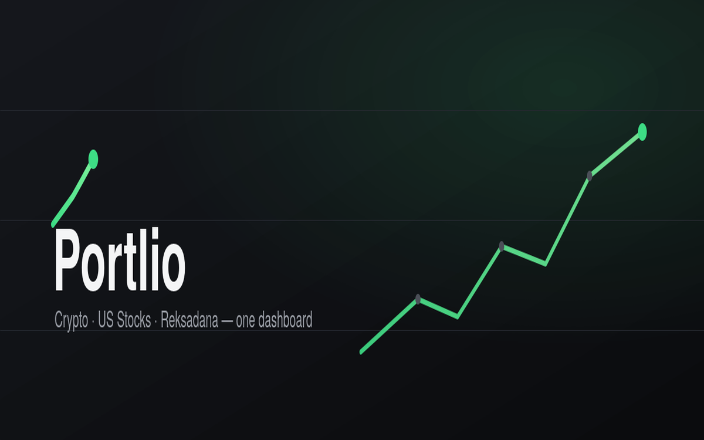

# Ferdy Diatmika Portfolio

[](https://github.com/faustroz/faustroz.github.io/actions/workflows/build.yml)

Personal portfolio for web, AI automation, FiveM, Roblox, and full-stack product work.

## Live URL

https://faustroz.github.io/

## Screenshots

### Portfolio Projects





## Featured Projects

- **Clipra** — AI video clipping workflow for transcripts, captions, and short-form exports.
- **Invopajak** — invoice and tax SaaS for Indonesian freelancers and UMKM.
- **Portlio** — finance dashboard for crypto, US stocks, and Indonesian reksadana.
- **Yomu** — manga/comic reader with search, chapters, history, and reading-first UI.
- **Confluo** — AI trading co-pilot concept for structured market alerts.

## Architecture

```text
app/
├── page.jsx                    # Main portfolio landing page
├── layout.jsx                  # App layout and metadata
├── globals.css                 # Global styles
└── portfolio-tracker/          # Public finance tracker demo

components/
├── hero.jsx                    # Landing hero
├── about.jsx                   # About section
├── portfolio.jsx               # Project cards
├── FooterConditional.jsx       # Footer visibility logic
└── portfolio/                  # Portfolio tracker UI components

lib/
├── utils.js
└── portfolio/                  # Finance calculations, prices, storage

public/
├── ferdy.webp                  # Profile image
└── portfolio/                  # Project screenshots
```

## Stack

- Next.js 14
- React 18
- Tailwind CSS
- Supabase client
- Chart.js / react-chartjs-2
- Framer Motion
- Radix UI primitives

## Setup

```bash
npm install
npm run dev
```

Open `http://localhost:3000`.

## Environment

Create `.env.local` if using the portfolio tracker storage feature:

```bash
NEXT_PUBLIC_SUPABASE_URL=your-project-url
NEXT_PUBLIC_SUPABASE_ANON_KEY=your-anon-key
```

## Database

Portfolio tracker setup lives in:

```text
supabase-portfolio-tracker.sql
```

Current tracker storage uses a shared public table. Add Supabase Auth before using it for private multi-user data.

## Build

```bash
npm run build
```

## Deployment

This site deploys with GitHub Pages from the `main` branch.

GitHub Actions workflow:

```text
.github/workflows/build.yml
```
